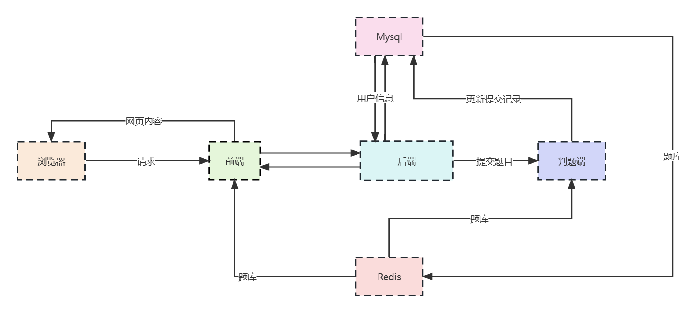
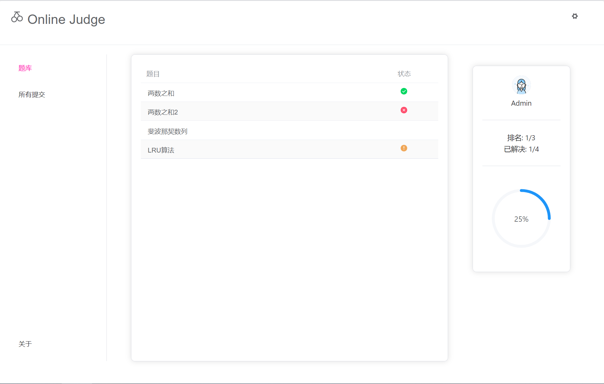
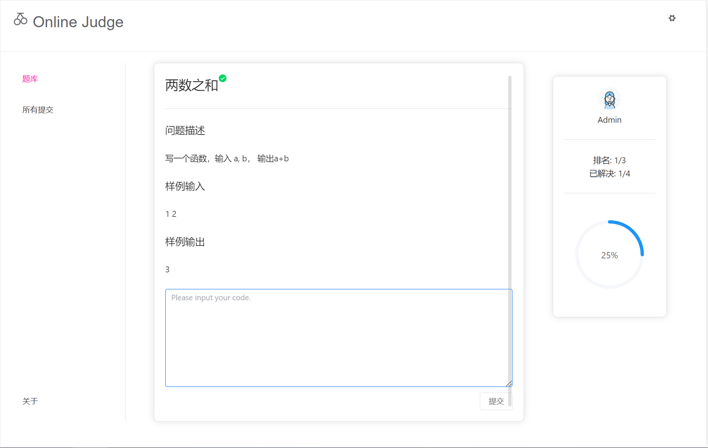

# A online-judge website. (Spring Boot/Vue/Mysql/Redis)

一个使用Java开发的Online Judge网站，支持提交Java代码解决算法问题并返回代码运行的不同结果，包含以下部分：

基于Socket、线程池、计时线程的判题端；

基于SpringBoot和Mybatis的业务逻辑后端；

基于Vue3 Element-plus的前端；

基于Redis的数据缓存策略。

这个项目即将完成







## 目录

- [启动](#启动)
- [作者](#作者)
- [等待加入的功能](#待实现)[init.sql](db%2Finit.sql)
- [已知的问题](#已知的问题)


### 启动

以下内容面向开发者

请运行以下命令以确保你安装了有效版本的 java8 \ Maven \ vue3 \ MySQL \ Redis：

```sh
java -version
mvn -v
vue -V
mysql -V
redis-server -v
```

##### 1. 克隆

```sh
git clone https://github.com/AMDNO2022/online-judge.git
```

##### 2. 启动判题端

配置你的文件
```sh
vim judge-server/src/JudgeServerProperties.properties
```
启动
```sh
java judge-server/src/JudgeServerMain.java
java judge-server/src/JudgeServerMain
```

##### 3. 启动后端 
导入mysql初始内容
```sh
mysql -uroot <db/init.sql
```
配置你的文件
```sh
vim judge-service/src/main/resources/application.properties
```

启动
```sh
cd judge-service
nohup mvn spring-boot:run &
```

##### 4. 启动前端
```sh
cd ../judge-front
npm install
nohup npm run dev &
```

### 作者

Wu F.Y

### 待实现
1. 后端
2. 前后端接通
3. redis缓存题库的策略
4. Record页面
5. 个人主页页面
6. rabbitmq代替判题端线程池
7. 日志
8. 后台管理

### 已知的问题
1. 分辨率缩小导致页面不能铺满屏幕

